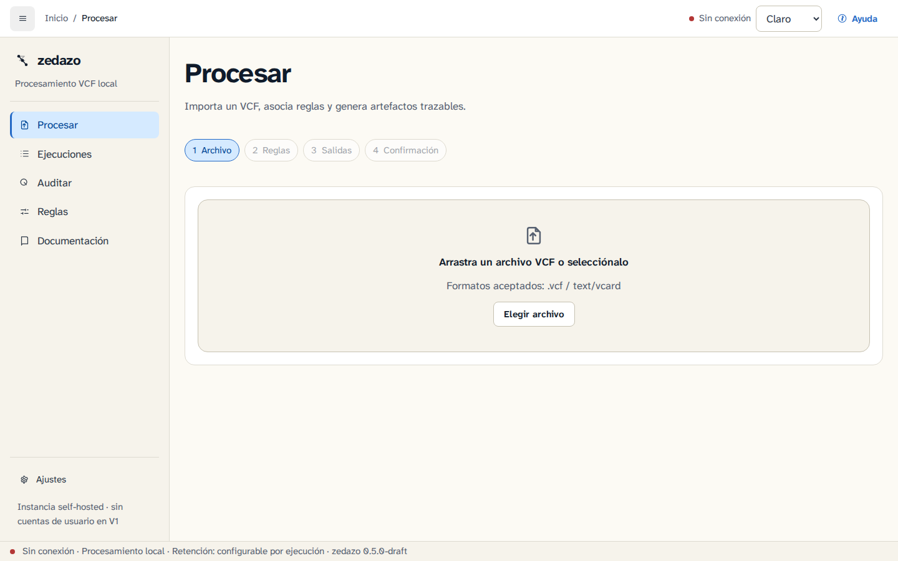
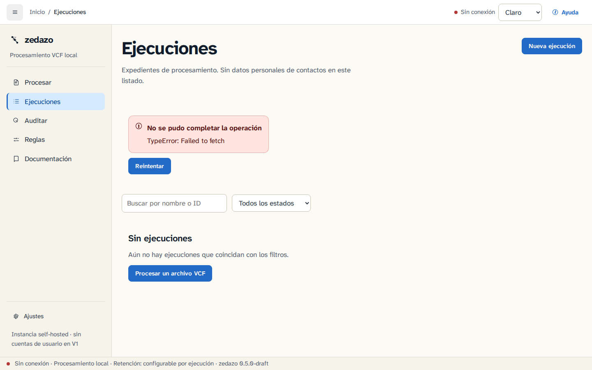
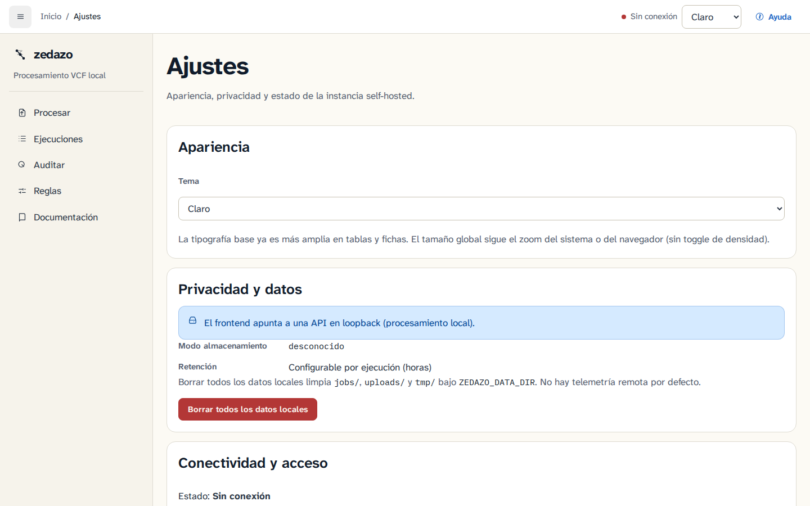
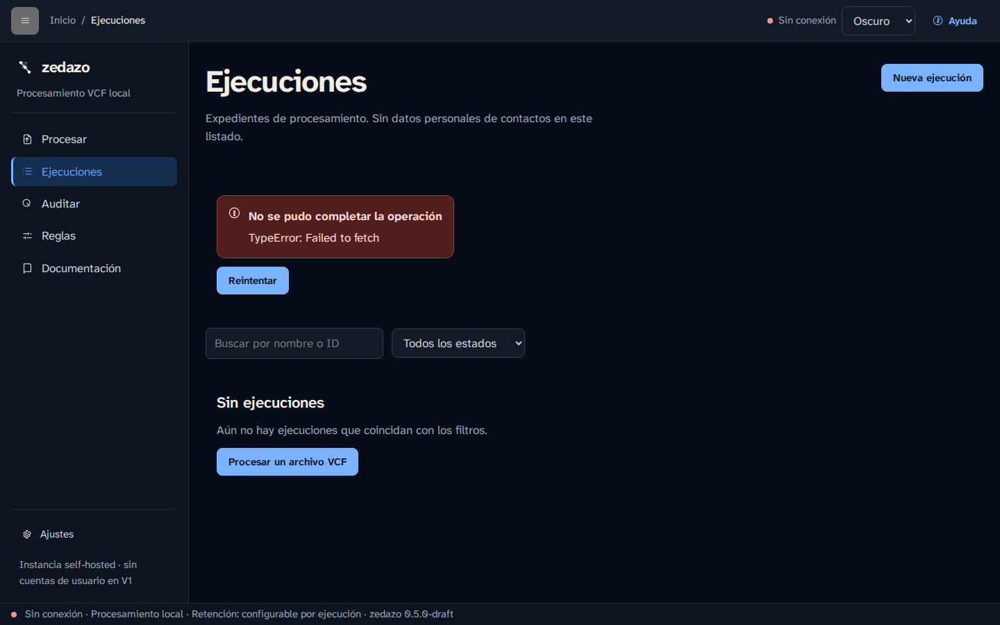
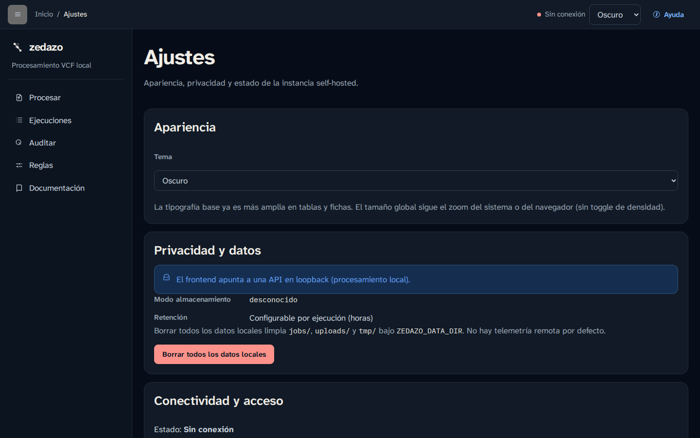

# zedazo

### Propósito de este documento

- **Objetivos:** Presentar el producto (CLI + GUI/API self-hosted), quick start y enlaces a contratos (AGENTS, SPECS, ARCHITECTURE, SECURITY, CONTRIBUTING, CoC, SUPPORT).
- **Estructura:** Propósito → badges → quick start → GUI → docs → desarrollo → licencia.
- **Contenido a integrar según contexto:** Conserva copy, wordmark `zedazo` y dual license. No copies un README de landing/SaaS ni tokens/DS de otro paquete. CI canónico = wrappers `quality` / `test` / `smoke` sobre jobs Rust maduros.

[](https://github.com/Soluciones-Alexendros/zedazo/actions/workflows/ci.yml)
[](https://github.com/Soluciones-Alexendros/zedazo/actions/workflows/audit.yml)
[](https://coveralls.io/github/Soluciones-Alexendros/zedazo?branch=main)
[](https://crates.io/crates/zedazo)
[](LICENSE-MIT)
[](https://blog.rust-lang.org/2024/07/25/Rust-1.80.0.html)
[](CONTRIBUTING.md)

**Tu agenda, pasada por el zedazo fino.**

Sitio de producto: [https://zedazo.alexendros.dev](https://zedazo.alexendros.dev) (landing en [`apps/landing/`](apps/landing/index.html); DNS: [docs/gui/deploy.md](docs/gui/deploy.md)). Wordmark: [`docs/brand.md`](docs/brand.md).

Criba, normaliza, clasifica y deduplica contactos VCF exportados desde **ProtonMail**, **Google Contacts** o **Apple iCloud**, con reglas deterministas, deduplicación transitiva y normalización de nombres y teléfonos.

Desde **v0.5.0** incluye **GUI web + API HTTP** self-hosted sobre el mismo core (`zedazo-core`): local en loopback (ADR-0015) y remoto single-user con HTTPS + token (ADR-0016). La CLI sigue siendo el canal oficial de automatización.

> Antes: `vcf-cribador`. Migración: ver [CHANGELOG 0.2.0](CHANGELOG.md#020---2026-08-15) y [ADR-0014](DECISIONS.md).

## Quick start

```bash
# Instalar
cargo install zedazo

# Cribar un archivo (conservados → limpio.vcf, trazabilidad → auditoría.tsv)
zedazo cribar mis-contactos.vcf -o limpio.vcf -a auditoria.tsv

# Solo auditar sin modificar
zedazo audit mis-contactos.vcf -o auditoria.tsv

# Estadísticas
zedazo stats limpio.vcf
zedazo stats limpio.vcf -f json
zedazo stats limpio.vcf -f markdown

# Exportar a CSV o JSON
zedazo export limpio.vcf -o contactos.csv
zedazo export limpio.vcf -o contactos.json -f json
```

## GUI / API self-hosted (ADR-0015 / ADR-0016)

Workspace: `crates/zedazo-core` · `crates/zedazo-cli` · `crates/zedazo-api` · `crates/zedazo-carddav` · `apps/web`.

```bash
# API local (auth disabled solo en loopback)
ZEDAZO_DATA_DIR=./data ZEDAZO_BIND=127.0.0.1:8080 cargo run -p zedazo-api

# Frontend
pnpm --dir apps/web install
pnpm --dir apps/web dev

# Docker local
docker compose -f deploy/docker-compose.yml up --build

# Docker remoto single-user (HTTPS + token)
cp deploy/.env.example deploy/.env   # editar token
docker compose -f deploy/docker-compose.remote.yml --env-file deploy/.env up --build
# → https://127.0.0.1:8443
```

Docs: [docs/gui/](docs/gui/) · OpenAPI [docs/api/openapi.yaml](docs/api/openapi.yaml) · [deploy.md](docs/gui/deploy.md). Tokens GUI (DTCG, ADR-0019): [`apps/web/tokens/`](apps/web/tokens/) · `pnpm --dir apps/web tokens:build`. Catálogo in-app: `/documentacion/ds` (plan [ejecutado](docs/gui/design-system-plan.md)).

## Capturas

| Procesar | Ejecuciones | Ajustes |
| --- | --- | --- |
|  |  |  |

<details>
<summary>Tema oscuro</summary>

| Procesar | Ejecuciones | Ajustes |
| --- | --- | --- |
|  |  |  |

</details>

## Demo en 60 segundos

```bash
# Fixture sintético de ejemplo
cp examples/sample.vcf /tmp/sample.vcf

# Stack local (API :8080, web :3000)
docker compose -f deploy/docker-compose.yml up --build
# Abrir http://127.0.0.1:3000 → Procesar → subir examples/sample.vcf

# O solo CLI
cargo install zedazo   # o binario de release tras tag v0.5.1
zedazo cribar examples/sample.vcf -o /tmp/out.vcf -a /tmp/audit.tsv
```

## Configuración

Opcional: crea un archivo TOML para personalizar el cribado.

```toml
# zedazo.toml
[zedazo]
prefijo_pais = "+34"         # prefijo telefónico por defecto
replace = false              # false = añade a los defaults, true = reemplaza
conservar_dominios = [       # dominios de email que NUNCA se eliminan
    "@example.org",
    "@admin.gob.es"
]
e2_keywords = [              # palabras clave adicionales para detección de spam
    "pharma",
    "jackpot"
]

[clasificacion]
replace = false              # false = añade a las reglas por defecto, true = reemplaza
[[clasificacion.reglas]]
regex = "(?i)rob[óo]tica|maker"
n1 = "TEC"
n2 = "TEC-HW"
n3 = "HW-MAKER"
```

```bash
zedazo cribar contactos.vcf --config zedazo.toml
```

La sección `[cribado]` sigue aceptándose con un warning de deprecación.

## CardDAV (ADR-0018 / v0.4.0)

Cliente RFC 6352 en CLI (`zedazo carddav`): pull, write opt-in, watch (CTag/sync-token) y filtros N1/N2. Sin GUI ni API. Guía: [`docs/carddav.md`](docs/carddav.md).

```bash
export ZEDAZO_CARDDAV_URL=https://cloud.example.test
export ZEDAZO_CARDDAV_USERNAME=ada
export ZEDAZO_CARDDAV_PASSWORD='contraseña-de-aplicación'
zedazo carddav list
zedazo carddav pull -o contactos.vcf --category PROF
zedazo cribar contactos.vcf -o limpio.vcf
# escritura remota: exige --confirm (no forma parte de cribar)
zedazo carddav put --href "$HREF" --input ada.vcf --etag "$ETAG" --confirm
zedazo carddav watch --interval 30 -o contactos.vcf
```

No uses `ZEDAZO_AUTH_TOKEN` (eso es de la GUI). HTTP 412 se reporta como conflicto; no hay overwrite silencioso.

## Pipeline

```
  VCF  ──→  Parse   ──→  Normalize  ──→  Classify  ──→  Screen  ──→  Dedup  ──→  Write
 4.0/3.0    unfold      FN · TEL · ORG    16 categorías     C2-C6          Union-Find     VCF
            unescape     E.164 · N7        N1 + N2          E1-E3          cierre         TSV
            grouped                                                     transitivo      CSV/JSON
```

| Etapa         | Descripción                                                                                           |
| ------------- | ----------------------------------------------------------------------------------------------------- |
| **Parse**     | RFC 6350 §3.2 (unfold), §3.4 (escape). Propiedades agrupadas (`ITEM1.EMAIL`). Compatibilidad v3 → v4. |
| **Normalize** | N1-N7: capitalización de nombres, extracción de títulos, cargos, partículas. T1-T4: E.164 + tipos T4.  |
| **Classify**  | Taxonomía N1/N2/N3: PROF, INST, FIN, FORM, TEC, HOST, TRAN, INMO, SERV, ASOC, SALUD, etc.                |
| **Screen**    | C2-C6: conservar por categoría. E1-E3: eliminar huérfanos, spam, email-only.                          |
| **Dedup**     | Union-Find con cierre transitivo. Coincidencia por TEL exacto, EMAIL fuzzy, FN fuzzy.                 |
| **Write**     | VCF 4.0 con folding 75 octetos. ADR y tipos T4 preservados. TSV de trazabilidad. CSV/JSON export.    |

## Ejemplo real

```
$ zedazo cribar contacts-2025.vcf -o limpio.vcf -a audit.tsv

=== Estadísticas de cribado ===
Total entrada:   475
  Conservados:   221
  Eliminados:    254
  Fusionados:    0
  Cuarentena:    0
  Needs Review:  1

Por categoría:
  FIN-CRYPTO:  3    FIN-FINTEC:  5    INST-AUT:  7
  PROF-JUD:    3    PROF-NOT:    2    PROF-COL:  4
  TEC-COM:     3    SALUD-SOC:   2    ...
```

## Arquitectura

```
crates/zedazo-core/     Dominio + application + infra I/O (sin HTTP)
crates/zedazo-cli/      Binario `zedazo` (Clap)
crates/zedazo-api/      API Axum `/api/v1` (+ auth ADR-0016)
crates/zedazo-carddav/  Cliente CardDAV (ADR-0018; publish = false)
apps/web/               GUI Next.js (solo HTTP; sin lógica de cribado)
apps/landing/           Ficha pública estática (zedazo.alexendros.dev)
deploy/                 Docker Compose local + remoto + landing (Caddy)
```

→ [`ARCHITECTURE.md`](ARCHITECTURE.md) · ADR-0015 · ADR-0016 · ADR-0018

## Documentación

| Documento | Contenido |
| -------------------------------------------------------------- | ---------------------------------------------------- |
| [`SPECS.md`](SPECS.md)                                         | Especificación, invariantes, criterios de aceptación |
| [`ARCHITECTURE.md`](ARCHITECTURE.md)                           | Clean Architecture, CI/CD, capas                     |
| [`ROADMAP.md`](ROADMAP.md)                                     | Hitos y criterios de salida                          |
| [`DECISIONS.md`](DECISIONS.md)                                 | ADR con IDs estables                                 |
| [`AGENTS.md`](AGENTS.md)                                       | Contrato para agentes de código                      |
| [`CONTRIBUTING.md`](CONTRIBUTING.md)                           | Flujo de contribución y `make ci`                    |
| [`SECURITY.md`](SECURITY.md)                                   | Avisos privados; no abrir issue público              |
| [`CODE_OF_CONDUCT.md`](CODE_OF_CONDUCT.md)                     | Código de conducta                                   |
| [`SUPPORT.md`](SUPPORT.md)                                     | Dónde pedir ayuda                                    |
| [`docs/gui/`](docs/gui/)                                       | Paridad O10, deploy (incl. DNS del dominio de producto), threat-model, retención, [plan design system](docs/gui/design-system-plan.md) (ejecutado; catálogo GUI `/documentacion/ds`) |
| [`docs/carddav.md`](docs/carddav.md)                           | CardDAV CLI pull/write/watch (ADR-0018 / #48)            |
| [`docs/api/openapi.yaml`](docs/api/openapi.yaml)               | Contrato HTTP `/api/v1`                              |
| [`docs/domain.md`](docs/domain.md)                             | Lenguaje ubicuo, entidades, rules                    |
| [`docs/implementation-guide.md`](docs/implementation-guide.md) | Guía de implementación (histórico MVP)               |
| [`docs/test-plan.md`](docs/test-plan.md)                       | Estrategia de testing, fixtures                      |
| [`docs/events.md`](docs/events.md)                             | Comandos, eventos                                    |

## Desarrollo

```bash
git clone https://github.com/Soluciones-Alexendros/zedazo.git
cd zedazo

make hooks     # instalar pre-commit hooks
make ci        # fmt + clippy + test + check + doc + docs-validate + parity + web-ci
make release   # build release
```

Ver [`CONTRIBUTING.md`](CONTRIBUTING.md) para la guía de contribución. Soporte: [`SUPPORT.md`](SUPPORT.md). Conducta: [`CODE_OF_CONDUCT.md`](CODE_OF_CONDUCT.md).

## Seguridad

Reporta vulnerabilidades de forma privada. Ver [`SECURITY.md`](SECURITY.md).

Ejecutamos `cargo audit` semanalmente (y en PRs del lockfile). Falla solo ante vulnerabilidades RustSec; ver [`SECURITY.md`](SECURITY.md).

## Licencia

MIT OR Apache-2.0 · Ver [`LICENSE-MIT`](LICENSE-MIT) y [`LICENSE-APACHE`](LICENSE-APACHE).
